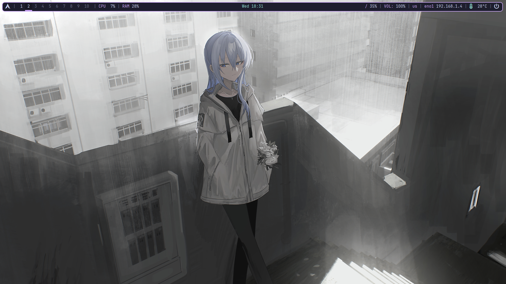

# dotfiles
this is my setup for bspwm
Polybar, link in here https://github.com/polybar/polybar, with cappucino theme
nitrogen
picom
and my setup for neofetch and fastfetch too
# shotcuts
`super + return` open kitty
`super + space` open rofi
`super + e` open dolphin
and that is
if you have something error or have comment, feel free! even my setup i based on somehing other's dotfiles
and this is the source of fasfetch config, i changed something to the fastfetch show the image : https://github.com/Meow0x7E/config-fastfetch
# Installing
`git clone https://github.com/noneisreal/dotfiles ~/dotfiles && cd ~/dotfiles`
`chmod +x install_bspwm_dotfiles.sh`
`./install_bspwm_dotfiles.sh`
# preview

